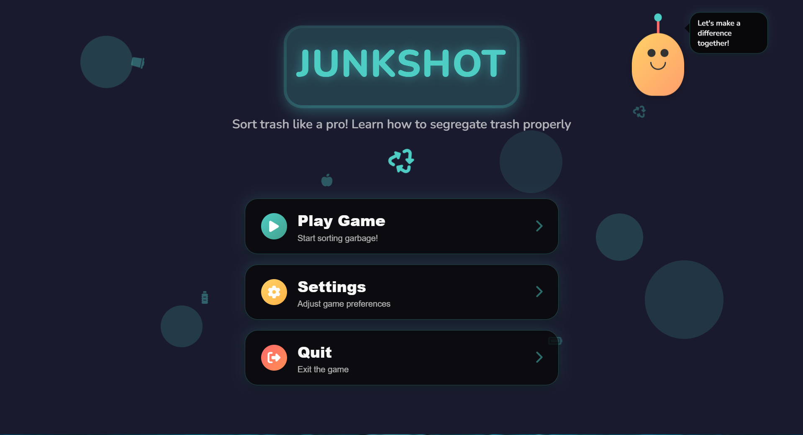
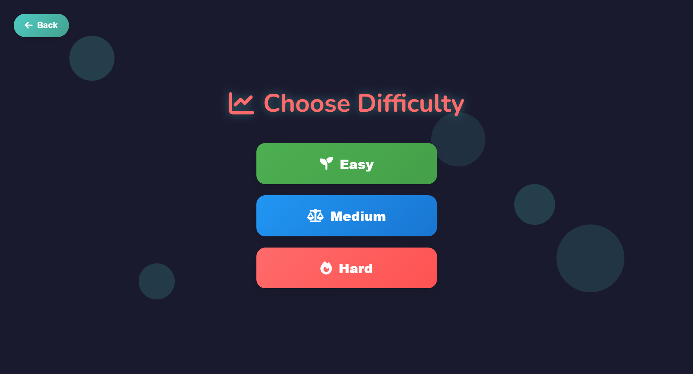
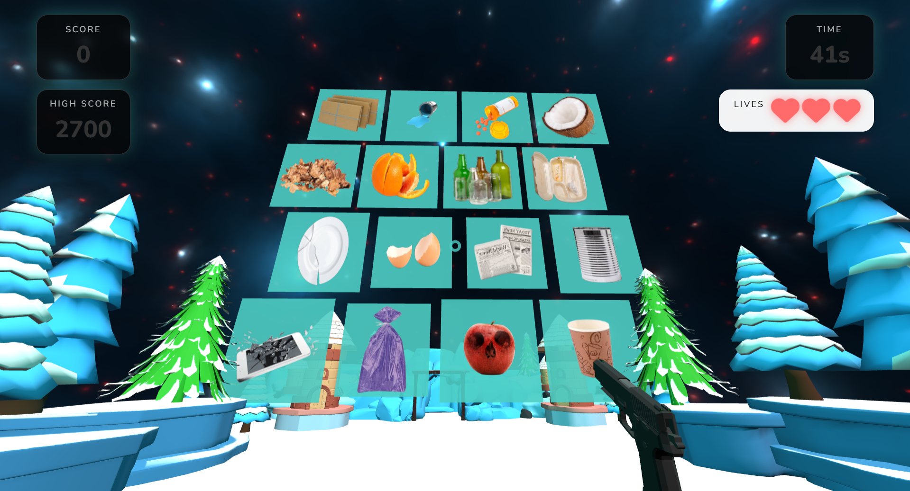

# JUNKSHOT – A Waste Segregation 3D Carnival Shooting Game


## An immersive 3D educational web game built with A-Frame + Three.js + Supabase


### Game Story & Concept

The idea for **Junk Shot** originated from our own campus, fueled by the frustrating reality that even among highly educated peers, proper recycling and waste segregation still can't be upheld. Our response to this was to develop **Junk Shot**, a high-energy, arcade-style game designed to fundamentally change behavior. It challenges players to rapidly and accurately "shoot" different types of waste that fit into different prompts. It's a practical, engaging solution that turns a serious environmental gap into a competitive challenge.


### Gameplay Overview

**The mechanic:**

- A 3D environment displays textured 3D garbage items.
- The player receives a prompt (e.g., “Shoot all ORGANIC waste!”).
- Using the 3D gun, the player shoots items matching the category.
- Hitting a wrong item deducts a heart (or ends the game on Hard mode).
- The game tracks and updates highest score based on difficulty.


### Game Screenshots

<div align="center">
  
  <p><em>Choose difficulty</em></p>
  
  <br>

  
  <p><em>In-game view: Shooting organic waste targets</em></p>
</div>


### Team Roles

**Jherzell** – UI & Assets
- All HTML pages
- CSS for full UI
- Finds 3D models + textures
- Audio assets (BGM & SFX)
- Visual consistency

**Alexia** – Backend & Core Logic
- Supabase integration
- API endpoints
- Game logic structure
- Project integration 
- Code review
- Project management

**Paul** – 3D & A-Frame Scene
- A-Frame world
- Gun + environment models
- Lighting, camera, environment
- Shooting system integration
- Hit & miss effects
- Background music + SFX implementation


### Tech Stack Used

***Frontend***
- A-Frame → core 3D scene, camera, gun model, collision shooting
- Three.js → object animations, lighting, movement logic
- HTML / CSS / Vanilla JavaScript → all UI screens
- LocalStorage → saves settings (volume, sensitivity)

***Backend***
- Supabase (PostgreSQL) → stores highest score per difficulty
- Vercel Serverless API Routes → GET/POST for high scores

***Deployment***
- Vercel → hosts frontend and backend
- GitHub → team collaboration + version control


### Installation & Setup

***1. Clone Repo***
```bash
git clone [https://github.com/Lex0411/Junk-Shot.git](https://github.com/Lex0411/Junk-Shot.git)
cd junk-shot
```

***Install Dependencies***
```
npm install
npm install -g vercel
```

***Create .env.local***
```
SUPABASE_URL="your_url"
SUPABASE_SERVICE_ROLE_KEY="your_service_role"
SUPABASE_ANON_KEY="your_anon_key"
```

***Run Locally***
```
vercel dev
```
